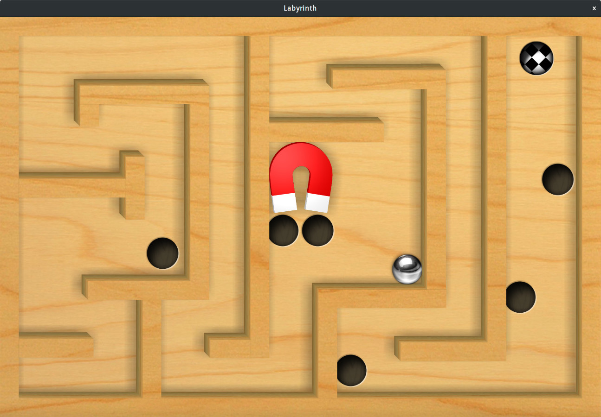

# Labyrinth

A Labyrinth game with OpenGL ES 2.0.

## Screenshot

## Technical Details

Rendering: LWJGL 3, OpenGL ES 2.0, GLFW.

Model: Assimp.

Lighting: Phong lighting model.

Collision detection: dyn4j, a Java implementation of algorithms in the Bullet engine.

Dynamic shadow: Soft shadow with PCF.

Sound effects: OpenAL.

Shaders can be found under [shader](res/cn/edu/zju/cs/graphics/labyrinth/shader), and rendering code can be found under [rendering](src/cn/edu/zju/cs/graphics/labyrinth/rendering).
